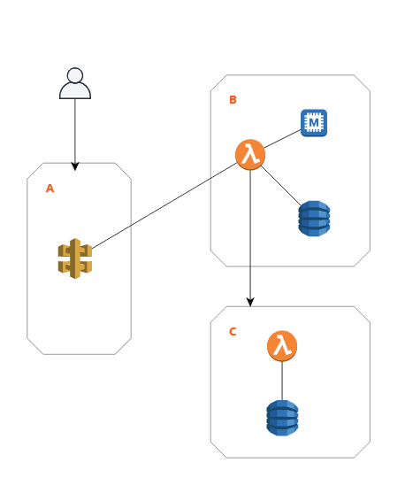
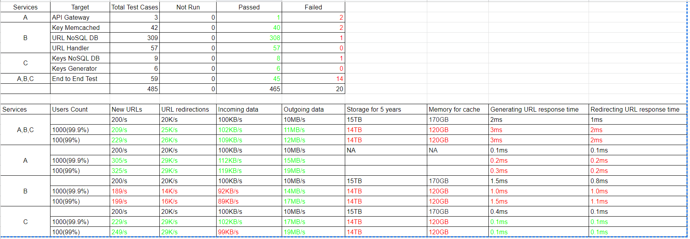

# 测试微服务的最佳实践-如何测试URL Shortening Service

1. 什么是URL Shortening Service
2. 需求评审和明确URL Shortening Service所要达到的目标
3. URL Shortening Service的性能指标评估
4. URL Shortening Service的拆分
5. 针对URL Shortening Service选择相应的测试工具
6. 为URL Shortening Service制定测试策略
7. 准备测试数据
8. 生成测试报告
9. 参考

## 什么是URL Shortening Service

URL Shortening Service是一个可以将长链接转化成短链接的线上服务。这些短链接与长链接一一对应，用户可以在浏览器里输入短链接，以此来访问长链接，这些长链接就是原始的URL。短链接有这些优点：占用少量的显示空间，可以用于各大线上媒体，软文，报纸或印刷体等；用户在输入短链接时，不容易出错！

例如，以下是一个原始的长链接：

```bash
https://2cloudlabs.com/collection/page/5668639101419520/5649050225344512/5668600916475904/
```

通过URL Shortening Service，我们可以得到以下短链接：

```bash
http://2cl.com/jlg8zpc
```

短链接的长度仅仅是长链接的三分之一。

## 需求评审和明确URL Shortening Service所要达到的目标

URL Shortening Service要实现的基本功能有以下几点：

* 功能性需求

1. 给定一个原始URL（也就是长链接），我们的URL Shorten Service应该生成一个唯一的短链接。这个短链接的长度应该缩减到一定范围，方便复制
2. 当终端用户访问短链接，我们的URL Shorten Service应该自动根据短链接跳转到原始URL

* 非功能性需求

1. 该URL Shortening Service应该高可用，也就是需要满足7*24小时全天候运转
2. 通过短链接访问原始URL所需的时间应该尽可能的短

## URL Shortening Service的性能指标评估

URL Shortening Service的特点是有大量的读操作，同时伴随着少部分的写操作。假设读与写的比例是100:1。接下来需要评估URL Shorten Service各项性能指标。

**流量估计**：假设每个月会生成500 million的短链接，根据读与写的比例来换算，同时期大约会有50 billion的短链接请求操作：

```bash
100 * 500M => 50B
```

根据以上读与写操作的数据，那么可以估算出对应的Queries Per Second（QPS）：

比如，针对写操作（也就是每个月生成500 million的短链接）的QPS，计算如下：

```bash
500 million / (30 days * 24 hours * 3600 seconds) = ~200 URLs/s
```

针对读操作（也就是每个月50 billion的短链接请求操作）的QPS，计算如下：

```bash
100 * 200 URLs/s = 20K/s
```

**存储估计**：假设我们需要存储每一个短链接以及对应的长链接，存储周期为5年。存储每一个短链接以及对应的长链接所需要的存储单元的大小为500 bytes，那么总的存储容量计算如下：

```bash
500 million * 5 years * 12 months * 500 bytes = 15 TB
```

**吞吐量估计**：由于写操作的速度是200 URLs/s，那么每秒向URL Shorten Service写入的数据量是100KB，计算如下：

```bash
200 * 500 bytes = 100 KB/s
```

读操作的速度是20K URLs/s，因此每秒从URL Shorten Service读出的数据量应该是10MB，计算如下：

```bash
20K * 500 bytes = 10 MB/s
```

总的来说，URL Shorten Service的吞吐量分为读取和写入，每秒读取数据的大小与写入数据的大小是不一致的，前者为10 MB/s，后者为100 KB/s。

**内存估计**：如果我们根据80-20原则来缓存数据，也就是我们会缓存20%的数据，那么每天需要缓存的大小是170GB，计算如下：

```bash
20K * 3600 seconds * 24 hours 0.2 * 500 bytes = 170GB
```

**响应时间估计**：URL Shorten Service主要提供2个功能，分别是生成短链接和根据短链接跳转到原始链接。每一个功能都应该有对应的响应时间，确保终端用户能够在有限的时间内得到响应，因此这两个功能的响应时间应该分别设置为2ms和1ms。响应时间的估算，可以通过类似的服务（比如bit.ly, qlink.me）来确定。

通过以上计算，可以列出与URL Shorten Service的性能指标，如下所示：

```bash
New URLs	                  200/s
URL redirections	          20K/s
Incoming data	              100KB/s
Outgoing data	              10MB/s
Storage for 5 years	          15TB
Memory for cache	          170GB
Generating URL response time  2ms
Redirecting URL response time 1ms
```

有了以上指标，接下来就需要围绕以上指标制定测试策略，选择相应的测试工具，准备测试数据，生成测试报告等。在进行日常的测试任务之前，需要对URL Shortening Service的构成有一定的了解。接下来需要对该服务进行拆分。

## URL Shortening Service的拆分

测试URL Shortening Service的目的在于确保以上所列举的指标是达到预期的。在实现这个目标之前，会遇到各种不达标的情况，因此为了进一步分析不达标的原因，则需要对该服务进行模块拆分。拆分的原因在于我们可以将问题所涉及的范围缩小，从而快速定位到哪里出现了问题。下图为URL Shortening Service的构成：



主要由3个服务组成，它们分别是A，B，C。它们的数据流是终端用户访问A，A将请求转发给B，B到C中获取唯一码，最终B将生成的短链接存储到数据库里。A，B，C是3种不同的微服务，它们的职责单一，比如A主要是限制终端用户每秒的请求量，旨在保护下游服务（下游服务有B）；B的主要作用在于生成短链接，并将短链接和长链接存储到数据库里；C的主要作用在于生成唯一的标识码，比如`http://2cl.com/jlg8zpc`中的`jlg8zpc`，并提供给B使用。每一个服务都会运行在多台服务器上（比如运行A服务的服务器可能需要2台，每台服务器上启动了3个docker实例，因此既一共有6个docker实例）。这种由多个微服务（A，B，C）来构成整个URL Shortening Service的软件架构就是我们常说的MicroServices。

通过以上分解，我们应该清楚地知道每个服务的职责是非常单一的，而且都有自己的数据库，它们之间是相对独立的，其交互是通过Restful API来完成。

## 针对URL Shortening Service选择相应的测试工具

当我们对URL Shortening Service的组成有了清晰的认识之后，接下来就需要针对这些组成部分选择对应的工具。

比如为了单独测试每一个服务（比如A服务），那么就必须摆脱对B服务的依赖。因此需要使用类似[mountebank](http://www.mbtest.org/)工具来模拟B服务。

为了针对每一个服务进行性能测试，那么我们需要借助工具[JMeter](https://jmeter.apache.org/)。

为了编写大量的测试脚本，那么我们需要借助工具Python或Go。

为了托管测试脚本，那么我们需要借助源码托管服务github和工具git。

## 为URL Shortening Service制定测试策略

选择好测试工具之后，就需要定制测试策略。测试的策略主要围绕以下5个部分展开：

1. 针对每一个服务进行测试
2. 将所有服务集成在一起测试
3. 如何将测试集成到CICD中，最终实现自动化
4. 采集和整理测试数据
5. 分配任务和指定测试计划

根据前面列举出来的性能指标以及经验，我们需要预估每一个服务所占用的指标情况。比如Generating URL response time是2ms，那么A，B，C服务分别使用的时间应该是0.1ms，1.5ms，0.4ms。通过这种办法，我们可以整理出每一个服务的性能指标。最终我们可以根据这些细分的指标来编写测试用例。

比如我们测试B服务的Generating URL response time，那么期望值是1.5ms。因此我们会使用[mountebank](http://www.mbtest.org/)来模拟C服务，并编写Python脚本来操作B服务（执行1000次，每次生成一个短链接），记录每一次生成短链接所需要的时间，最终看看99.9th的时间是否少于1.5ms，如果少于，那么测试通过，否则无法通过。通过这种方式可以获得每一个服务对应指标的真实数据，这些数据需要整理成报告以便后续分析问题。

当每一个服务通过测试之后，那么需要将所有服务集成在一起进行测试。集成测试除了需要根据以上方法进行测试之外，还需要注意其依赖关系。集成测试通过之后，也会采集到对应的性能指标，这些指标是真实的，需要整理成测试报告。

每个服务的测试和集成测试所获得的测试报告应该集中在一起，分发给团队内部的相关研发人员，比如研发，测试，DevOps，架构师等。

以上过程如果手动完成那么是比较耗时低效的。因此需要考虑将以上过程集成到CICD中。集成到CICD的基本思路如下：

* 每名测试人员提交测试用例，此时会自动触发对应服务的测试，如果通过则进行下一步
* 自动触发集成测试
* 生成测试报告，并通过邮件分发给相关的团队成员
* 测试通过之后，需要自动地部署到staging环境

## 准备测试数据

## 生成测试报告

测试报告是测试团队对外的输出结果，因此非常重要！大家不仅可以通过这份测试报告来了解产品的运行状态，而且可以通过这份报告来排查问题。公司需要根据这些报告对客户发布SLAs条款，比如1000个用户使用URL Shortening Service生成短链接，其中999个用户所等待的时间将小于2ms。以下是一份关于URL Shortening Service的测试报告：



这份测试报告主要分成上下2部分，上半部分是关于测试用例的运行状况，下半部分是关于性能指标的。

## 参考

[Designing a URL Shortening service like TinyURL](https://www.educative.io/courses/grokking-the-system-design-interview/m2ygV4E81AR)